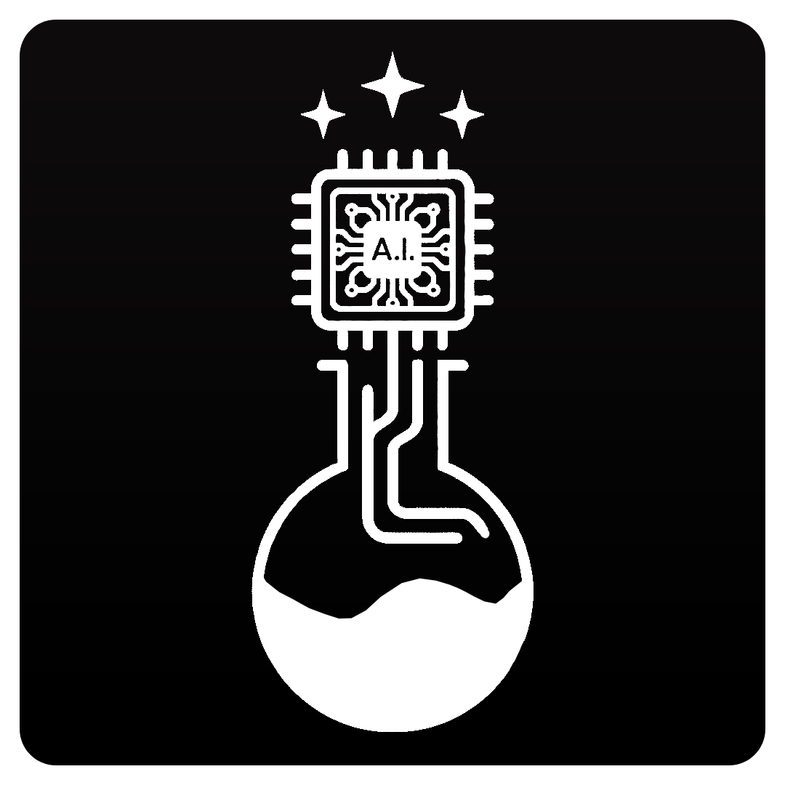

<p align="center">
  
</p>

<h3 align="center">Orellius Eye</h3>
<p align="center">Visual perception MCP server — screenshots, UI inspection, element detection.</p>

<p align="center">
  <a href="https://orellius.ai">Website</a> · 
  <a href="https://github.com/OrelliusAI">GitHub</a>
</p>

---

## What it does

Gives AI agents visual perception of running desktop applications. Takes screenshots, inspects UI trees, finds elements by text or role, and reports window geometry. Works across Electron, Tauri, Flutter, Qt, and SwiftUI apps.

## Install

```bash
npx orellius-eye
```

Or globally:

```bash
npm install -g orellius-eye
```

## Quick start

Add to your MCP config:

```json
{
  "mcpServers": {
    "eye": {
      "command": "npx",
      "args": ["orellius-eye"]
    }
  }
}
```

## Features

- 6 tools: screenshot, detect_app, inspect_ui, find_element, get_window_info, list_windows
- CDP (Chrome DevTools Protocol) + accessibility API support
- Cross-platform: macOS, Linux, Windows
- Works with Electron, Tauri, Flutter, Qt, SwiftUI apps
- Image optimization via sharp
- Element detection by text, role, or CSS selector

## Tech stack

TypeScript, MCP SDK, chrome-remote-interface, sharp

## License

MIT — [Orellius Labs](https://orellius.ai)
